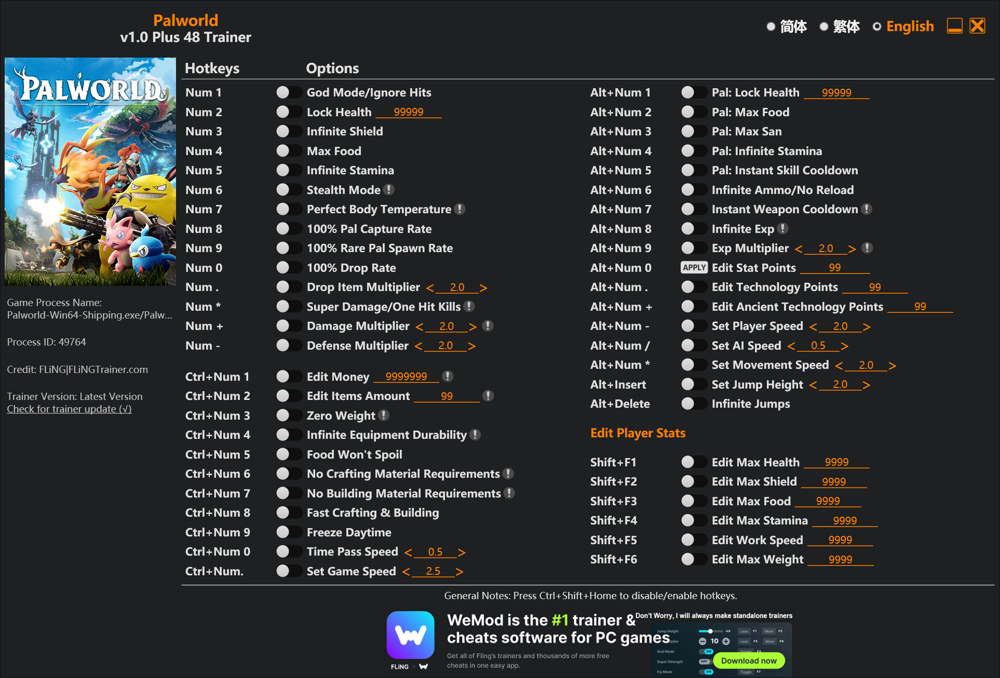

# 🐾 Palworld Trainer (v1.0 Plus 48)

A powerful, high-performance memory modifier utility designed for **Palworld**. This trainer allows for real-time manipulation of player statistics, Pal attributes, economic variables, and crafting requirements.

Optimized for stealth execution, minimal resource footprint, and seamless integration with the game's engine.

---

## 🚀 Key Features

* **Player Empowerment:** Toggle God Mode, infinite stamina, ignore hunger, and perfect body temperature control.
* **Pal Mastery:** Instant skill cooldowns, infinite stamina, 100% capture rate, and boosted rare spawn rates.
* **Economic & Crafting Control:** Instant construction, zero material requirements, infinite money, and infinite inventory item quantities.
* **Stat Editor:** Comprehensive control over player attributes (Health, Shield, Stamina, Work Speed, Weight).
* **Global Game Modifiers:** Control time-of-day speed, movement speed, and jump height.

---

## ⌨️ Hotkeys & Options Reference

### 👤 Player & World
| Hotkey | Cheat Option | Description |
| :--- | :--- | :--- |
| **Num 1-5** | Player Essentials | God Mode, Health, Shield, Food, Stamina |
| **Num 6** | Stealth Mode | Enemies ignore player presence |
| **Num 7** | Perfect Body Temp | Immune to environmental hazards |
| **Num 8-9** | Capture & Spawn | 100% Capture Rate / Boosted Rare Spawn |
| **Num 0** | Drop Rate | 100% Item Drop Rate |
| **Num . / +** | Modifiers | Damage & Defense Multipliers |

### 🐉 Pal & Combat
| Hotkey | Cheat Option | Description |
| :--- | :--- | :--- |
| **Alt + Num 1-5** | Pal Stats | Infinite Health, Food, Sanity, Stamina, Instant Cooldown |
| **Alt + Num 6-7** | Weaponry | Infinite Ammo / No Reload, Instant Weapon Cooldown |
| **Alt + Num 8** | Experience | Infinite XP Gain |

### 🛠 Economy, Crafting & Movement
| Hotkey | Cheat Option | Description |
| :--- | :--- | :--- |
| **Ctrl + Num 1-2** | Wealth | Add Money, Edit Item Quantities |
| **Ctrl + Num 3** | Zero Weight | Infinite Inventory Capacity |
| **Ctrl + Num 4-8** | Crafting/Build | Durability, Food Preservation, Instant Build/Craft |
| **Alt + Num 0 / .** | Global Speed | Freeze Daytime / Set Game Speed |

### 📈 Advanced Stat Editor (Player Stats)
| Hotkey | Cheat Option |
| :--- | :--- |
| **Shift + F1-F6** | Edit Max Health, Shield, Food, Stamina, Work Speed, Weight |

---

## 🛠 Installation & Usage

1. **Extract Assets:** Download and unpack the trainer executable into any directory.
2. **Launch Sequence:** * Launch **Palworld** and load into your world.
   * Run the trainer executable with **Administrator Privileges**.
3. **Activation:** Press the designated Numpad keys to enable or disable features. An audio cue will signal successful memory attachment.

> ⚠️ **IMPORTANT SAFETY NOTICE**
> * **Single-Player Only:** This tool is designed strictly for **single-player offline gameplay**. Do not attempt to use memory modifiers on official or public servers, as this will result in immediate anti-cheat detection and account banning.
> * **Backup Saves:** Before using advanced features (like editing stats or item amounts), always back up your save files located at `%LOCALAPPDATA%\Pal\Saved\SaveGames`.

---
